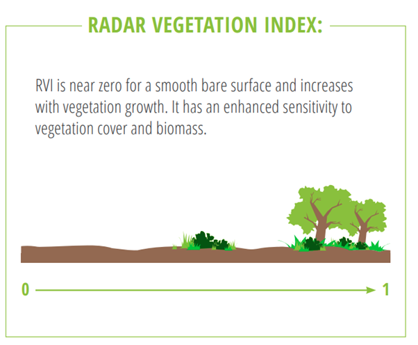
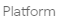
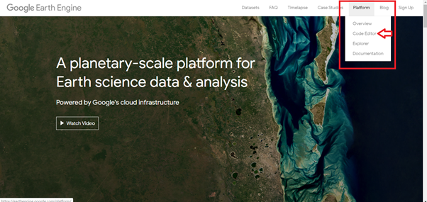
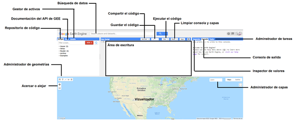
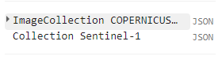
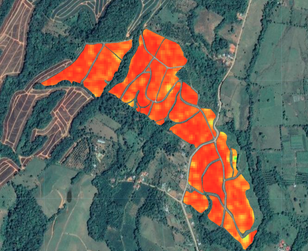
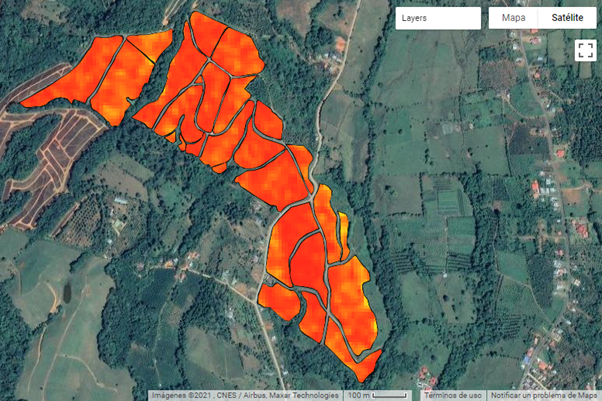
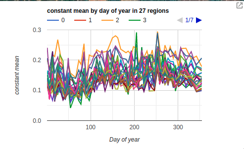
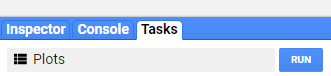

# RVI


<h1>Imágenes Radar de Apertura Sintética (SAR) en Google Earth Engine aplicado a la agricultura</h1> 
<h2>Índice de Vegetación con Radar (RVI), para el monitoreo de cultivos </h2> 

<p>Este manual fue elaborado por la Escuela de Geografía de la Universidad de Costa Rica, para el cual colaboraron Emmanuel Jesús Céspedes-Rivera y Cristian Aguilar-Barboza en calidad de asistentes avanzados del proyecto "Transformación digital: Incorporación de tecnología SAR en la gestión de riesgos, agricultura y recursos naturales para Centroamérica", en el marco del proyecto UCREA-IICA.</p>
<p>Este proyecto está coordinado por el Dr Edgar Espinoza Cisneros y co-cordinado por MSc María José Molina Montero. Para mayor información contactar a maria.molinamontero@ucr.ac.cr .</p>

<p>Índice</p> 

<p><li><a href="#Sección1">1. Prerrequisitos</a></li>
<li><a href="#Sección2">2. Introducción</a></li>
<li><a href="#Sección3">3. Interfaz de Google Earth Engine</a></li>
<li><a href="#Sección4">4. Procesamiento y análisis</a></li>
<li><a href="#Sección5">5. Conclusiones y recomendaciones</a></li>
<li><a href="#Sección6">6. Bibliografía</a></li></p> 

<p><h2 id="Sección1">1. Prerrequisitos</h2></p>


<p>Para ejecutar esta rutina el usuario previamente debe crear una cuenta en la plataforma Google Earth Engine (GEE), ingresando en <p><a href="https://earthengine.google.com/" target="_blank">https://earthengine.google.com/</a></p> GEE, es una plataforma para la visualización y análisis de datos geoespaciales en la nube, por lo tanto, no existe la necesidad de invertir equipos y programas especializados (Google Earth Engine, 2019). GEE tiene disponible repositorios de información entre los cuales se encuentran: series temporales de Landsat, Sentinel, MODIS, SRTM, entre otros.</p> 

<p>Esta plataforma utiliza en su editor de código el lenguaje de programación JAVA, aunque también posee una API Python vinculada al Google Drive.</p> 

<p>Como guía para crear una cuenta en GEE ingrese a:</p> 


<p><a href="https://www.youtube.com/watch?v=E60J32Umqeo" target="_blank">https://www.youtube.com/watch?v=E60J32Umqeo</a></p>


<p><h2 id="Sección2">2. Introducción</h2></p>

<p>El monitoreo de cultivos es una de las principales herramientas en agricultura, la estimación del área de cobertura, productividad, incidencia de enfermedades, evolución o cambios en la estructura de los cultivos...etc. Actividades que resultan fundamentales en términos de estudiar y mejorar la actividad agrícola (Mutanga & Kumar, 2019).</p> 

<p>Para el caso de GEE, es una plataforma en la nube que posee acceso de diferentes repositorios de información, caso de Landsat, MODIS, Sentinel, SoilGrids, SRTM, ALOS-Palsar, HydroSheds entre muchos otros que favorecen el monitoreo agrícola de forma gratuita y sin cargas computacionales elevadas. </p> 

<p>La detección remota con sensores ópticos requieren de observaciones con productos de buena calidad, libre de nubes o sombras de nubes para minimizar la confusión espectral de los datos (Shen et al., 2019), sin embargo, en zonas tropicales las coberturas nubosas son constantes y abundantes, su aplicación resulta limitada (Flores et al., 2019). Debido a este aspecto, se ha implementado el uso de la imágenes SAR, la cual despeja la limitante de la nubosidad y permite la obtención continua de información (Flores et al., 2019).</p> 

<p>En tanto los datos SAR son efectivos en este tipo de estudios, sin embargo, la descarga y pre-procesamiento de los datos en “crudo” directamente en el ordenador requiere de alta capacidad de procesamiento, elemento que puede ser omitido con el uso de GEE. El cual, provee información pre-procesada y lista para el análisis y monitoreo agrícola.</p>  

<p>Este manual muestra el procedimiento para construir un índice de Vegetación con Radar (RVI por sus siglas en inglés), índice que tiene un gran potencial en la vigilancia de la dinámica de la vegetación a lo largo de periodos de tiempo (Agapiou, 2020). Cambios en los valores del índice pueden estar relacionados, la disminución de la cobertura vegetal, cambios fenológicos en las plantas, variaciones en la estructura de las plantas, así como cambios en los usos de la tierra (deforestación, urbanización, entre otros).</p> 

<p>El RVI a construir sigue lo propuesto por Agapiou (2020) , cuya expresión matemática se muestra en la fórmula 1. Este índice oscila entre 0 y 1, como medida de la aleatoriedad de la retrodispersión. Los valores cercanos a cero se encuentran relacionados con coberturas lisas o descubiertas, el aumento de este índice está ligado a una mayor cobertura vegetal (Fig 1).</p> 

<h2>RVI =(VV/(VV+VH))<sup>0.5</sup>(4VH)/(VV+VH) (1) </h2>              


<h4 id="Sección3">Fig 1. Índice de Vegetación con Radar.</h4>

<p><h3>2.1. Objetivos de aprendizaje:</h3></p>

<p><li>Introducir al manejo de la interfaz de editor de código de GEE.</li>
<li>Analizar los procesos de interacción de la señal SAR con la superficie terrestre.</li>
<li>Observar y monitorear los cambios temporales en cultivos de caña a partir de un RVI.</li>

<p><h2 id="Sección3">3. Interfaz de Google Earth Engine</h2></p>
 

<p>Para abrir el editor de código ingrese en: <a href="https://earthengine.google.com/" target="_blank">https://earthengine.google.com/</a>, y ubiquese en la opción   
 (Fig 2), luego seleccione Code Editor.</p> 
  

<h4 id="Sección3">Fig 2. Acceso al code editor desde la página web de Google Earth Engine.</h4>

<p>Una vez hecho esto se le desplegará el editor de código de GEE, el cual se detalla en la Fig 2.</p> 
  

<h4 id="Sección3">Fig 3. Interfaz de editor de código GEE.</h4>

<p>Es importante señalar que en la plataforma en “repositorio de código” en la sección de <strong>“Examples”</strong> puede encontrar una serie de códigos de ejemplo con diferentes tipos de datos de origen con los cuales puede experimentar y editar a conveniencia para diferentes aplicaciones.<p>
 
 <p><h2 id="Sección4">4. Procesamiento y análisis</h2></p>
 
 <p> <Strong><h3>Nota:</h3></Strong> El código ejecutado en el presente manual se puede acceder por medio del siguiente link: <a href="https://code.earthengine.google.com/196705f589fc389e6406e745cc0fecfc" target="_blank">https://code.earthengine.google.com/196705f589fc389e6406e745cc0fecfc</a><p>
 
<p> También pueden acceder a los datos de las parcelas utilizadas en el presente manual en el siguiente link: 
 <a href="https://drive.google.com/drive/folders/13XEGpP1Gs8Pawdz48Exa7PRGuYC0V-Cz?usp=sharing
" target="_blank">https://drive.google.com/drive/folders/13XEGpP1Gs8Pawdz48Exa7PRGuYC0V-Cz?usp=sharing
</a><p>
 
 <p>Primero se debe generar un punto (utilice el administrador de geometrías), a partir del cual se mostrará el nivel de zoom y del centro del despliegue del visualizador, esto se ejecuta a través de la casilla <Strong>Geometry imports</Strong>, en donde se le asigna el nombre de “geometry”. Usando esta misma herramienta se pueden generar las parcelas de su interés (“plot”) con las que se trabajará en el presente manual. 

<p>Una vez realizado este paso se procede a establecer que la visualización se muestra con base a una imagen RGB satelital y se define el centro de visualización y el nivel de zoom respectivamente. </p>
 

```javascript
Map.setOptions('satellite');
Map.centerObject(geometry, 16);
```

<p>Se definen las fechas de inicio y final para filtrar la colección de imágenes.</p>

```javascript
var START1 = ee.Date("2020-01-01");
var END1 = ee.Date("2020-12-31");
```

<p>Seguidamente proceda a llamar la colección de imágenes de GRD de Sentinel-1, tanto para las polarizaciones  VV, como VH. Además, se recorta en relación con las parcelas digitalizadas previamente.</p>

```javascript
 // Call the collection of Sentinel-1 with the polarizations VV and VH
var collectionVVVH =  ee.ImageCollection('COPERNICUS/S1_GRD')
.filter(ee.Filter.listContains('transmitterReceiverPolarisation', 'VV'))
.filter(ee.Filter.listContains('transmitterReceiverPolarisation', 'VH'))
.filter(ee.Filter.eq('orbitProperties_pass', 'DESCENDING'))
.filter(ee.Filter.eq('instrumentMode', 'IW'))
.filterBounds(plot)
.select('VV','VH' )
.filterDate(START1,END1)
.map(function(image){return image.clip(plot)});
```

<p>Puede observar la información de la colección con el siguiente fragmento de código. Las comillas después de la coma y su contenido detallan el nombre con el que se observará la colección en la consola (Fig 4).</p>


```javascript
print(collectionVVVH, 'Collection Sentinel-1')
```


<h4 id="Sección4">Fig 4. Despliegue de la función “print()” en la consola de GEE. </h4>
 
<p>A continuación se prepara la función que utiliza como base la fórmula del RVI. En este punto no hemos aplicado la fórmula sobre la colección es solo la preparación de la función.</p>
 

```javascript
// This function gets RVI from Sentinel-1 imagery. The formula of RVI was obtained from doi:10.3390/app10144764.
var addRVI = function(image) {
  return image.addBands(image.expression('(VV/(VV + VH))**0.5*(4*VH)/(VV + VH)', {
    'VV': image.select('VV'),
    'VH': image.select('VH'),})
    .copyProperties(image,['system:time_start','system:index']).set('Date', ee.Date(image.get('system:time_start')).format('yyyy-MM-dd'))
)};
```
 
<p>Una vez ejecutado lo anterior se aplica la función del RVI sobre la colección, es importante recordar que está fórmula se ejecuta sobre valores lineales de retrodispersión, de modo que este paso también se incluye la función de conversión de valores de dB a valores lineales.</p>

```javascript
// Map the function over the collection.
var RVICollection = collectionVVVH.map(addRVI).map(function toNatural(image) {
return ee.Image(10.0).pow(image.select(0).divide(10.0))
.copyProperties(image,['system:time_start','system:index']).set('Date', ee.Date(image.get('system:time_start')).format('yyyy-MM-dd'))
  });
```

<p>Para observar los detalles de la colección se imprime en la consola y además añadimos al visualizador las parcelas digitalizadas.</p>

```javascript
print(RVICollection, 'RVI');
Map.addLayer(plot,{},'Plots');
```

<p>Una vez añadidas las parcelas, se procede con la preparación de los parámetros para observar dos imágenes de diferentes periodos con el RVI calculado.</p>

```javascript
//Preparation of the input parameters of the layers to be added
var visParams = {min: 0, max: [1], bands: ['constant'],palette: [
  '#ff261b','#ff8319', '#ffcf1f', '#d1ff1b', '#87ff19','#18ff29']};
```

<p>Finalizado la preparación de los parámetros de visualización,se filtra la colección por fecha para seleccionar una imagen de un momento dado. La función “select()” permite seleccionar la banda de cálculo que por defecto se nombra por GEE como “constant”, el cual es el RVI obtenido (Fig 5).</p>

```javascript
// Display the mapping results of the function .
var fit = RVICollection.filterDate('2020-01-01','2020-01-22').select('constant')
var fit2 = RVICollection.filterDate('2020-03-01','2020-03-22').select('constant')
```

<p>Para desplegar los resultados del RVI en el visualizador de capas (Layers) utilizamos la función “Map.addLayer()”.</p>


```javascript
Map.addLayer(fit, visParams,'RVI of the image 2020-01-01');
Map.addLayer(fit2, visParams,'RVI of the image 2020-03-13');
```

<h4 id="Sección4">Fig 5. Resultados obtenidos del RVI 2019-12-20, añadidos al visualizador de datos.</h4>


<h4 id="Sección4">Fig 6. Resultados obtenidos del RVI 2020-03-13, añadidos al visualizador de datos.</h4>

<p>Para visualizar los cambios anuales para los dos años de estudio se puede graficar las variaciones promedio del RVI por parcela y determinar posibles causas de estas variaciones. A continuación copie y pegue la siguiente línea de código para establecer los parámetros de entrada del gráfico.</p>


```javascript
// The graphic is a mean of time series, January of 2020 to December of 2020, see the linear values the differences
var chart = ui.Chart.image.doySeriesByRegion({
  imageCollection: RVICollection,
  bandName:'constant',
  regions: plot,
  regionReducer: ee.Reducer.mean(),
  scale: 200,  
  seriesProperty:'system:index',
});
```

<p>Para visualizar el gráfico (Fig 7) en el visualizador de capas (Layers) utilice la siguiente línea de código.</p>


```javascript
// Add the chart to the map. 
// Note, in this case, the images not have a Speckle Filter and are a values of RVI that have been obtained with de conversion of dB to linear values
chart.style().set({
  position: 'bottom-left',
  width: '500px',
  height: '300px'
});
Map.add(chart);
```

<h4 id="Sección4">Fig 7. Valores promedio por parcela de RVI entre Enero- Marzo de 2020.</h4>

<p>Finalmente puede exportar las parcelas digitalizadas como archivo de extensión .shp a su cuenta de Google Drive desde donde puede descargarla y visualizarla fuera del entorno de GEE.</p>

```javascript
// Export the SHP (the plots), specifying scale and region.
Export.table.toDrive({
collection: plot ,
description: 'Plots',
fileFormat: 'SHP',
});
```
<p>Para realizar este proceso debe ir a la sección <Strong>Task</Strong>, en donde se muestra una lista con nombre asignado de salida (“Plots”) y presionar <Strong>RUN</Strong> (Fig 8).</p> 


<h4 id="Sección4">Fig 8. Exportar el archivo .shp desde Task.</h4>

<p>Para exportar el RVI como un Geotiff puede utilizar la siguiente expresión. En este caso se exporta el RVI  para la imágen de enero de 2020, puede replicar este proceso para el RVI de marzo 2020.</p>

```javascript
// Export the RVI. 
Export.image.toDrive({
image: fit,
description: 'RVI of the image 2020-01-01',
scale: 30,
region: plot,
  maxPixels: 1e13
fileFormat: 'GeoTIFF',
});
```

<p><h2 id="Sección5">5. Conclusiones y recomendaciones.</h2></p>

<p>La gran cantidad de repositorios de información que ofrece GEE, permite el análisis de múltiples fenómenos, sin recurrir a la descarga de información ni cargas computacionales de hardware y software elevadas. A su vez permite el análisis detallado de series de tiempo asociados a sus repositorios de información, tal fue el caso de Sentinel-1 ejecutado en este manual.</p> 
 
<p>La disponibilidad de imágenes SAR pre-procesadas reduce los tiempos de ejecución. Además de favorecer la ejecución de grandes conjuntos de datos en un mismo proceso (Big data).</p> 
 
<p>En relación a los diferentes procesos disponibles, la plataforma de GEE posee la capacidad de ejecución de una gran variedad de procesos que permiten el monitoreo no únicamente agrícola sino de diferentes elementos como el bosque, ciudades, cuerpos de agua, inundaciones entre muchos otros que hacen de ella una herramienta muy potente.</p>

<p>Por otro lado, el editor de código ofrece gran versatilidad al ejecutar procesos, no obstante, requiere conocimientos básicos en programación.</p> 

<p>El RVI es un insumo valioso para el monitoreo de cultivos, bosques y otros ecosistemas, especialmente en un contexto tropical donde la nubosidad es constante, y, que limita la generación de índices a partir de sensores ópticos como el popular NDVI.</p>

<p><h2 id="Sección6">6. Bibliografía.</h2></p>

Flores, A. I., Herndon, K. E., Bahadur Thapa, R., & Cherrington, E. (Eds.). (2019). The Synthetic Aperture Radar (SAR) Handbook: Comprehensive Methodologies for Forest Monitoring and Biomass Estimation. <a href="https://doi.org/10.25966/nr2c-s697" target="_blank">https://doi.org/10.25966/nr2c-s697</a></p>

Mutanga, O., & Kumar, L. (2019). Google Earth Engine Applications. Remote Sensing, 11(5), 591.  <a href="https://doi.org/10.3390/rs11050591" target="_blank">https://doi.org/10.3390/rs11050591</a></p>

Shen, W., Li, M., Huang, C., Tao, X., Li, S., & Wei, A. (2019). Mapping annual forest change due to afforestation in Guangdong Province of China using active and passive remote sensing data. Remote Sensing, 11(5), 1-21.  <a href="https://doi.org/10.3390/rs11050490" target="_blank">https://doi.org/10.3390/rs11050490</a></p>
